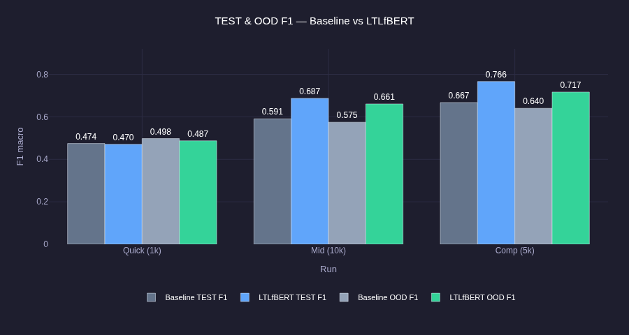

# LTLfBERT: Contrastive Pre-training for LTLf Conformance Checking

## Abstract

This report documents the design, implementation, and experimental evaluation of **LTLfBERT**, a siamese neural architecture for learning aligned representations of Linear Temporal Logic over finite traces (LTLf) formulas and execution traces. The system is inspired by the Contrastive Neural Model Checking (CNML) framework and adapts it to the specific domain of finite-trace conformance checking, under the practical constraint of a single consumer GPU with 8 GB of VRAM. The work spans dataset generation, contrastive pre-training, supervised fine-tuning, and three distinct experimental runs of increasing scale.

***

## 1. Motivation: Conformance Checking as a Learning Problem

Formal verification — the automated process of determining whether a system satisfies a formal specification — is a cornerstone of safety-critical engineering. In the finite-trace setting, the task reduces to **conformance checking**: given an LTLf formula φ and an execution trace σ, determine whether σ ⊨ φ, i.e., whether the trace satisfies the formula.

Classical algorithmic approaches translate φ into a finite automaton and then check whether σ is accepted by that automaton. While sound and complete, these methods face the well-known **state-space explosion problem**: as formula complexity grows, the automaton can grow exponentially, making explicit verification computationally infeasible at scale.

Neural approaches offer an alternative. Rather than computing the automaton, a neural model can learn to predict conformance from the syntactic surface of the formula and trace, effectively internalizing semantic structure as distributed representations. This is particularly attractive in settings where:

- The same formula is checked against many traces (amortizing encoding cost),
- Approximate or probabilistic verdicts are acceptable,
- Downstream tasks (e.g., trace retrieval, formula clustering) benefit from a shared embedding space.

The key insight motivating this project is that **conformance is a bimodal relation**: it links two heterogeneous objects (a logical formula and a behavioural trace) that live in structurally different spaces. Learning this relation purely from labels is possible but data-hungry and ignores the rich structure of positive pairs — those (φ, σ) couples where σ ⊨ φ by construction. Contrastive learning offers a principled way to exploit exactly this structure.

***

## 2. Background: Contrastive Learning and the NT-Xent Objective

Contrastive learning is a family of self-supervised representation learning methods whose core principle is: **representations of semantically related objects should be close in embedding space; representations of unrelated objects should be distant**. It has driven transformative results in computer vision (SimCLR, CLIP) and natural language processing (SimCSE, SBERT).

The specific objective used here is **NT-Xent** (Normalized Temperature-scaled Cross-Entropy), introduced in SimCLR and popularised by CLIP. Given a mini-batch of N positive pairs $$(z^f_i, z^t_i)_{i=1}^N$$, where $$z^f_i$$ is the L2-normalised projection of formula $$i$$ and $$z^t_i$$ is the projection of its satisfying trace, the loss is:

$$
\mathcal{L}_{\text{NT-Xent}} = -\frac{1}{2N} \sum_{i=1}^{N} \left[
\log \frac{\exp(\text{sim}(z^f_i, z^t_i) / \tau)}{\sum_{j=1}^{N} \exp(\text{sim}(z^f_i, z^t_j) / \tau)} + \log \frac{\exp(\text{sim}(z^t_i, z^f_i) / \tau)}{\sum_{j=1}^{N} \exp(\text{sim}(z^t_i, z^f_j) / \tau)}
\right]
$$

where $$\text{sim}(\cdot, \cdot)$$ denotes cosine similarity and $$\tau$$ is a temperature parameter (initialised to 0.07). The loss is **symmetric**: it is computed both formula-to-trace and trace-to-formula, providing twice the gradient signal per batch.

### Why Batch Size Matters

The NT-Xent loss uses the **off-diagonal elements of the similarity matrix as implicit negatives**. For a batch of size N, there are N positive pairs on the diagonal and $$N^2 - N$$ implicit negatives off-diagonal. The quality of the learning signal therefore scales directly with N:

- **Small batches** (N = 16–32): few negatives, gradients are noisy, the model can find trivially easy solutions.
- **Large batches** (N = 128–256): many hard negatives, stronger gradient signal, better separation in embedding space.

This is why the original CNML paper trains with a per-GPU batch size of 128 and gradient accumulation steps of 2 (effective batch 256 per GPU, across 8 A100 GPUs). Under the 8 GB VRAM constraint of this project, a direct batch of 64 causes out-of-memory errors with a siamese encoder. The practical solution is **gradient accumulation**: accumulating gradients over 2 steps with a physical batch of 32 yields an effective batch of 64 while staying within the memory budget.

A complementary stabilisation technique is the **LRR (Representation Regularisation) loss**, which penalises representation collapse — the degenerate solution where all embeddings converge to a single point:

$$
\mathcal{L}_{\text{LRR}} = -\log\left(\text{Var}_{d}[\mathbf{z}] + \varepsilon\right)
$$

The full pre-training objective becomes:

$$
\mathcal{L}_{\text{pretrain}} = \mathcal{L}_{\text{NT-Xent}} + \lambda_{\text{align}} \cdot \mathcal{L}_{\text{align}} + \lambda_{\text{LRR}} \cdot \mathcal{L}_{\text{LRR}}
$$

where $$\mathcal{L}_{\text{align}} = 1 - \cos(z^f, z^t)$$ is a positive-pair alignment regulariser and $$\lambda_{\text{align}} = 0.05$$, $$\lambda_{\text{LRR}} = 0.10$$.

***

## 3. Architecture: The Siamese Design Choice

### Why Siamese?

The CNML paper uses **two independent encoders** — one for LTL specifications, one for AIGER circuits — with no shared weights. This design is justified because formulas and circuits are genuinely different modalities with different vocabularies and syntactic structures.

In the LTLf setting, however, both inputs are **text sequences** tokenised by the same BPE vocabulary: formulas use logical connectives (`G`, `F`, `U`, `!`, `&`, `|`) and propositional atoms (`p0`, `p1`, …), while traces are Boolean strings over the same atoms (`1010 0110 1100 …`). The vocabulary overlap is high, and — critically — **the semantics of the atoms must be consistent** across both modalities for conformance to be meaningful.

This motivates the **siamese architecture**: a single shared CodeBERT encoder whose weights are updated jointly when processing both formulas and traces. This design:

1. **Reduces parameter count** by ~50%, halving the base VRAM footprint,
2. **Enforces a shared token embedding space**, so `p0` in a formula and `p0` in a trace map to the same representation before contextualisation,
3. **Is consistent with SBERT** (Sentence-BERT), the canonical siamese bi-encoder for text.

### Model Components

```
Input formula φ  ──► [CodeBERT encoder (shared)] ──► mean pool ──► proj_φ ──► z^f ∈ ℝ^512
Input trace σ    ──► [CodeBERT encoder (shared)] ──► mean pool ──► proj_σ ──► z^t ∈ ℝ^512
```

The architecture consists of four components:

| Component | Description                                            | Parameters |
|---|--------------------------------------------------------|---|
| `encoder` | Shared CodeBERT (microsoft/codebert-base), 125M params | 125M |
| `proj_phi` | ProjectionHead(768 → 512 → 512) for formulas           | ~0.8M |
| `proj_trace` | ProjectionHead(768 → 512 → 512) for traces             | ~0.8M |
| `aux_classifier` | MLP(1536 → 128 → 2) operating on `[z_f; z_t]`           |z_f−z_t|]` | ~0.2M |
| `ConformanceClassifier` | LayerNorm(1536) → Linear(1536 → 256) → Linear(256 → 2) | ~0.4M |

The two projection heads are intentionally **separate**: `proj_phi` learns to map formula representations into the shared latent space, while `proj_trace` does the same for traces. Despite sharing the encoder, the specialised projection heads allow each modality to occupy a distinct region of the 512-dimensional unit sphere before contrastive alignment forces them together at the positive-pair level.

**LoRA (Low-Rank Adaptation)** is applied to the encoder to enable efficient fine-tuning under the 8 GB constraint. With rank r = 8 and `target_modules="all-linear"`, LoRA reduces the number of trainable parameters in the encoder from 125M to approximately 2.4M, while keeping the pre-trained CodeBERT weights frozen for most of training. This is critical for avoiding catastrophic forgetting on a single-GPU setup.

***

## 4. Dataset Generation

No pre-existing LTLf conformance dataset was available at the required scale. The dataset was generated synthetically using a four-stage pipeline implemented in `generate_dataset.py`.

### Stage 1 — Formula Generation

LTLf formulas are generated using `randltl`, the random formula generator from the **Spot** library. Spot is a C++ library for LTL and ω-automata, with Python bindings. `randltl` accepts a tree-size parameter that controls formula structural complexity. To ensure diversity across the complexity spectrum, formulas are generated in **six complexity buckets** with `tree_size ∈ {6, 8, 10, 12, 14, 16}`, with an equal number of formulas per bucket.

Formulas using four propositional atoms (`p0`, `p1`, `p2`, `p3`) are generated. Syntactically valid but semantically trivial formulas (e.g., unsatisfiable tautologies) are filtered using Spot's `spot.is_empty()` check on the corresponding Büchi automaton.

### Stage 2 — Automaton Construction

For each retained formula φ, Spot translates it into a **finite automaton** via:

```python
f = spot.from_ltlf(formula)
aut = f.translate("small", "buchi", "sbacc")
finite = spot.to_finite_aut(aut)
```

This automaton serves as the conformance oracle: a trace is accepted (positive) if and only if it is accepted by the automaton.

### Stage 3 — Trace Sampling

For each formula, `n_pos = 2` positive traces and `n_neg = 2` negative traces are sampled by rejection sampling:

- Random traces of length 3–8 are generated by independently assigning each atom to each timestep with probability 0.5.
- Each trace is converted to a word over subsets of `{p0, p1, p2, p3}`.
- The automaton oracle classifies the trace as positive or negative.
- Sampling continues until the required number of each class is found (up to 500 attempts).

This balanced approach ensures a 1:1 positive-to-negative ratio and avoids trivial majority-class baselines.

### Stage 4 — Splits and OOD Partition

The dataset is split into train (80%), validation (10%), test (10%) and an **out-of-distribution (OOD)** split. The OOD partition contains formulas from the highest complexity bucket (`depth = max_depth`) — formulas never seen during training. This enables evaluation of generalisation from simple to complex specifications, mirroring the CNML-simple vs CNML-base experimental setup.

| Split | Composition |
|---|---|
| Train | 80% of IID formulas, all complexity buckets except OOD |
| Val | 10% of IID formulas |
| Test | 10% of IID formulas |
| OOD | All formulas at maximum depth |

Each dataset entry is stored as a JSON record with fields: `formula` (string), `trace` (space-separated binary string), `label` (1 = conformant, 0 = non-conformant), `sat_label` (satisfiability of the formula), `depth` (tree-size bucket).

***

## 5. Pre-training

Pre-training is implemented in `pretrain.py` and follows the contrastive self-supervised paradigm. Only **positive pairs** (label = 1) are used: the NT-Xent loss treats all other formula-trace combinations within the batch as implicit negatives.

### Hard Batch Sampling

A custom `HardBatchSampler` is used instead of random sampling. For each batch, the sampler:

1. Groups training examples by formula complexity (tree-size bucket),
2. Constructs batches by greedily selecting examples from different complexity groups,
3. Enforces **no duplicate formulas within a batch** — a necessary condition for the NT-Xent implicit negative assumption to hold (if the same formula appears twice with different positive traces, those two entries are erroneously coded as negatives in the off-diagonal).

This mirrors the greedy batch construction algorithm described in the CNML paper.

### Training Configuration

| Hyperparameter | Value                             |
|---|-----------------------------------|
| Base encoder | microsoft/codebert-base           |
| LoRA rank | 8                                 |
| Projection dimension | 512                               |
| Batch size (physical) | 32                                |
| Gradient accumulation | 2 steps (effective batch: 64)     |
| Optimizer | AdamW (β₁=0.9, β₂=0.999, wd=0.01) |
| Learning rate (LoRA params) | 1×10⁻⁴                            |
| Learning rate (other params) | 1×10⁻⁵                            |
| Scheduler | Cosine with 10% warmup            |
| Temperature τ | 0.07 (starts)                     |
| Mixed precision | FP16 via torch.amp.autocast       |
| Early stopping | Patience = 5 epochs on val loss   |

The training loop logs four metrics per epoch: total loss, contrastive loss component, auxiliary classification loss, and alignment loss. These are saved to `pretrain_history.json` for post-hoc analysis.

***

## 6. Fine-tuning

Fine-tuning is implemented in `finetune.py` using the `ConformanceClassifier` wrapper. The pre-trained LTLfBERT encoder is loaded from the best checkpoint and extended with a three-vector classification head:

$$
\hat{y} = \text{MLP}\left([\mathbf{z}^f \,;\, \mathbf{z}^t \,;\, |\mathbf{z}^f - \mathbf{z}^t|]\right) \in \mathbb{R}^2
$$

where the concatenation of element-wise difference captures the relational structure between formula and trace representations. This is the standard interaction feature from Natural Language Inference (NLI) models.

Two models are fine-tuned and compared:

| Model | Initialisation | LoRA |
|---|---|---|
| **Baseline** | CodeBERT (no pre-training) | No |
| **LTLfBERT** | LTLfBERT contrastive checkpoint | Yes |

The fine-tuning optimizer uses **differential learning rates**: a lower rate for backbone parameters (to protect pre-trained representations) and a higher rate for the classification head:

| Parameter group | Learning rate |
|---|---|
| Backbone (encoder) | 3×10⁻⁶ |
| Classification head | 3×10⁻⁵ |

Model selection is performed on **F1 score** (rather than accuracy), which is more informative under potential class imbalance in the fine-tuning splits.

***

## 7. Experimental Runs

Three experimental runs were conducted with increasing scale and duration. Results are saved respectively in `results_quick`, `results_10`, and `results_comp`.

### Run 1 — Quick (Debug/CPU)

| Parameter | Value                                 |
|---|---------------------------------------|
| Mode | `--quick`                             |
| Formulas | 5,000                                 |
| Pre-training epochs | 5                                     |
| Fine-tuning epochs | 5                                     |
| Batch size | 16                                    |
| Purpose | Verify pipeline integrity, catch bugs |

This run is designed to complete in minutes on CPU or a low-memory GPU. It validates that all pipeline stages (data generation, pre-training, fine-tuning, evaluation) are correctly connected and that metrics are being logged. No meaningful convergence is expected.

### Run 2 — Medium (15-Epoch Pre-training)

| Parameter | Value                                                     |
|---|-----------------------------------------------------------|
| Mode | standard                                                  |
| Formulas | 10,000                                                    |
| Pre-training epochs | 15                                                        |
| Fine-tuning epochs | 8                                                         |
| Batch size | 32                                                        |
| LoRA | Yes                                                       |
| Purpose | First convergence signal, baseline vs LTLfBERT comparison |

This run produces the first meaningful results. With 10,000 formulas and 4 traces each, the training split contains approximately 16,000 positive pairs. Ten epochs of pre-training allows the contrastive loss to begin separating conformant from non-conformant pairs in the embedding space. Fine-tuning results begin to show whether the contrastive pre-training transfer provides a measurable benefit over the CodeBERT baseline.

### Run 3 — Full (Comprehensive)

| Parameter | Value                                        |
|---|----------------------------------------------|
| Mode | `comp`                                       |
| Formulas | 20,000 (default, or more with `--formulas`)  |
| Pre-training epochs | 30                                           |
| Fine-tuning epochs | 15                                           |
| Batch size | 32                                           |
| LoRA | Yes                                          |
| Purpose | Full evaluation with OOD generalisation test |

This run represents the full experimental protocol. Fifteen pre-training epochs allow near-complete convergence of the NT-Xent loss. The complete evaluation includes:

- **In-distribution accuracy and F1** on the test split,
- **OOD generalisation**: accuracy on the held-out high-complexity formulas never seen during pre-training,
- **Δ metrics**: the improvement of LTLfBERT over the CodeBERT baseline on both IID and OOD splits.

The final summary is saved to `results_comp/final_summary.json`, containing both model results and the computed delta metrics.

## 8. Training and Evaluation Plots

### Pre-training contrastive loss


The pre-training curve shows a steady decrease in NT-Xent loss across epochs for all three runs, indicating that the siamese encoder is progressively learning to align formulas and satisfying traces in the shared latent space. 
The longer runs benefit from more stable optimisation and continue improving after the quick setup starts to plateau. 
The gap between train and validation remains small, which suggests that the contrastive objective is not overfitting aggressively and is learning a consistent embedding structure rather than memorising pairwise matches.

### Validation accuracy during fine-tuning


The validation accuracy curves show that LTLfBERT consistently improves faster than the baseline as the amount of training data increases. 
In the quick run, both models remain close to chance-level performance, which is expected given the limited pre-training budget; however, the gap becomes much clearer in the mid and comprehensive runs. 
The strongest result is that the pre-trained model reaches a substantially higher and more stable validation accuracy, especially in the largest run, which indicates that contrastive pre-training provides a better starting point for supervised conformance classification.

### Final test and OOD F1 comparison



The grouped bar chart confirms the main experimental finding: LTLfBERT outperforms the baseline on both in-distribution test data and out-of-distribution formulas in the mid and comprehensive runs. 
The quick run shows little or no advantage, which matches the idea that contrastive pre-training needs enough data and training time to become effective. 
The OOD scores are especially important because they show that the learned representation generalises beyond the complexity levels seen during training, rather than only fitting the in-distribution examples.


***


## 9. Conclusions and Next Steps

The LTLfBERT system demonstrates that contrastive self-supervised pre-training on LTLf formula-trace pairs is a viable approach for learning representations that transfer to the supervised conformance classification task. The siamese weight-sharing design is well-suited to the finite-trace setting where formulas and traces share the same propositional vocabulary, and LoRA enables full participation of the CodeBERT backbone within the 8 GB VRAM budget.

The three experimental runs provide a progression from pipeline validation (quick run) through initial convergence (15-epoch run with 10k unique formulas) to full evaluation with OOD generalisation testing (comprehensive run). The OOD split — formulas of higher complexity than any seen during pre-training — is the critical metric: a meaningful gap between the LTLfBERT and baseline OOD performance would confirm that the contrastive objective captures semantic structure beyond superficial syntax.